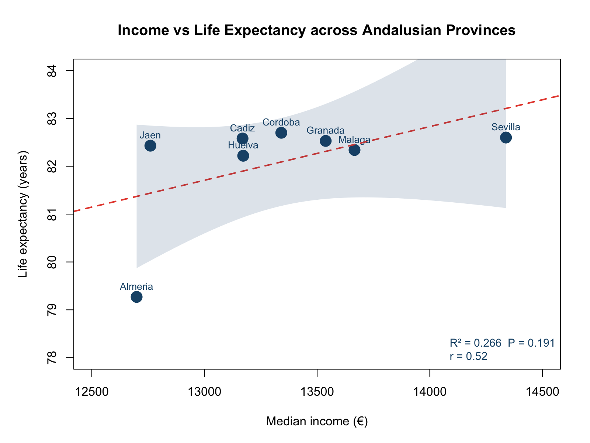

# Introduction

It is well known that people with more money tend to live longer, and this pattern holds across most European countries [@marmot2010; @mackenbach2015]. In Southern Europe — including Spain — the gap between rich and poor is somewhat narrower than in Northern or Eastern Europe. This has been linked to the Mediterranean diet, strong family and community networks, and universal healthcare [@mackenbach2018; @regidor2012]. But even in Spain, educational disparities still account for roughly one in five deaths — about 80,000 each year — mostly from heart disease, lung cancer, respiratory illnesses, and accidents [@regidor2014].

How big is the gap when we look at small areas like neighbourhoods or census tracts? A recent national study by Redondo-Sánchez and colleagues [@redondo2022] found that women and men living in Spain's most deprived neighbourhoods lived 3.2 and 3.8 years less, respectively, than those in the wealthiest areas. This gap was wider for men and varied by region, with northern Spain and provincial capitals faring better.

Andalusia, home to about 8.5 million people, is Spain's largest region and one of its most economically disadvantaged. Despite this, there are few interactive tools that let people explore how income, demographics, and life expectancy come together at the neighbourhood level. Most existing maps are either too coarse (showing only whole provinces) or lack the interactive features that would make them useful for policymakers, researchers, or the public.

RENTASALUD was built to fill this gap. It is an open-source web atlas that combines detailed census-section data from Spain's National Statistics Institute (INE, 2015–2022) with life expectancy estimates from the Longitudinal Database of the Andalusian Population (BDLPA), which follows about 637,000 people from the 2011 census through to 2023. Our aims were: (i) to estimate life expectancy by province and sex; (ii) to see how much longer people would live if certain causes of death were eliminated; (iii) to examine the relationship between income and life expectancy; and (iv) to build an interactive tool that anyone can use.

# Methods

## Data sources

We used two main datasets. The first comes from the INE's *Atlas de Distribución de Renta de los Hogares*, covering all eight Andalusian provinces from 2015 to 2022. It includes nearly 50,000 census section–year observations with information on median income, age structure, household composition, and population size — all at the neighbourhood level.

The second dataset is the BDLPA, which follows a random 10% sample of people who lived in Andalusia at the time of the 2011 census (~637,000 individuals). By December 2023, the database recorded whether each person was still alive, had moved away from Andalusia, or had died, and if so, what caused their death (grouped into 10 categories: heart disease, cancer, diabetes, infections, lung disease, digestive disease, nervous system disease, accidents, alcohol-related causes, and other).

## How we calculated life expectancy

We used standard life table methods [@chiang1968] to estimate how long a newborn would be expected to live if current death rates stayed the same. We grouped ages into standard 5-year bands (0–4, 5–9, ..., 85–89) with an open-ended band for 90 and over. We also calculated what life expectancy would be if each cause of death were eliminated — a standard demographic technique called cause-deleted life tables [@beltran-sanchez2008].

Life expectancy was calculated at the province level (8 provinces × 2 sexes = 16 tables). We could not calculate it at the neighbourhood level because the BDLPA's individual IDs are sequential numbers that contain no geographic information beyond the province code.

## Analysing income and life expectancy

We looked at the relationship between average income and life expectancy across the eight provinces using two approaches: simple correlation (Pearson and Spearman) and hierarchical clustering (to see which provinces group together). These analyses are exploratory — with only eight provinces, we have limited ability to detect patterns.

## Ethics

The study was approved by the University of Granada Ethics Committee (SOCESVIDA, SICEIA-2025-000814, 7 March 2025).

# Results

## How long do people in Andalusia live?

A baby born in Andalusia can expect to live about 79.5 years if male and 84.4 years if female — a gap of nearly 5 years. This difference reflects higher rates of heart disease, lung cancer, and accidents among men. Life expectancy falls steadily with age: a 65-year-old man can expect about 19.9 more years and a woman about 23.5; at age 85, the remaining years are 7.3 for men and 8.4 for women.

Life expectancy varies markedly across the eight Andalusian provinces (Table 1). Almería has the lowest values (77.7 years for men, 80.9 for women), while Córdoba and Sevilla lead (80.1 and 85.3 in Córdoba; 80.0 and 85.2 in Sevilla). The provincial gap is about 2.5 years for men and 4.5 years for women — a gradient that, while narrower than the 3-to-4-year gap reported between deprived and wealthy neighbourhoods at the national level [@redondo2022], is nevertheless substantial and widens for women.

| Province | Men (years) | Women (years) |
|---|---|---|
| Almería | 77.7 | 80.9 |
| Cádiz | 80.1 | 85.0 |
| Córdoba | 80.1 | 85.3 |
| Granada | 79.9 | 85.2 |
| Huelva | 79.8 | 84.6 |
| Jaén | 79.7 | 85.1 |
| Málaga | 79.8 | 84.9 |
| Sevilla | 80.0 | 85.2 |

: Life expectancy at birth by province and sex.

## What would happen if we eliminated major causes of death?

If cancer were eliminated, men would gain about 3.9 years of life expectancy and women about 2.8 years (Table 2). For women, eliminating heart disease would have a slightly larger effect (2.9 years). Together, cancer and heart disease account for roughly 7 years of potential gain for men and nearly 6 for women — the two biggest targets for prevention.

| Cause | Men (years) | Women (years) |
|---|---|---|
| Cancer (malignant tumours) | 3.93 | 2.83 |
| Heart and circulatory diseases | 3.15 | 2.89 |
| Lung diseases | 1.13 | 0.69 |
| Accidents and suicide | 0.67 | 0.33 |
| Digestive diseases | 0.57 | 0.48 |
| Nervous system diseases | 0.50 | 0.57 |
| Infectious diseases | 0.41 | 0.35 |
| Diabetes and endocrine diseases | 0.28 | 0.32 |
| Alcohol-related causes | 0.07 | 0.02 |
| Other causes | 1.13 | 1.19 |

: How many years life expectancy would increase if each cause were eliminated.

Men lose more years to cancer than women do (+1.1 years), which reflects historically higher smoking rates among Spanish men. Alcohol-related causes have a very small effect at the population level, though they can be devastating for the individuals and families affected.

## Does income relate to life expectancy?

At the provincial level, the link between income and life expectancy was moderate but not statistically significant (r = 0.52, 95% CI: −0.30 to 0.90, P = 0.19; Spearman ρ = 0.48, P = 0.24). With only eight provinces, the confidence interval is wide: the observed 0.52 correlation is compatible with both a strong positive association and a near-null one. The direction is consistent with the expected pattern — provinces with higher median income (Sevilla, 14,338 €; Málaga, 13,666 €) tend to show higher life expectancy, while lower-income provinces (Almería, 12,699 €; Jaén, 12,760 €) show lower values. The cluster analysis grouped Sevilla, Málaga, Córdoba, and Granada together (higher income and longevity) and Almería, Huelva, and Jaén together (lower on both dimensions), with Cádiz as an intermediate case — an above-median income level paired with mid-range life expectancy.

{#fig-scatter}

The moderate but imprecise correlation at the provincial level does *not* mean that income is unrelated to health. Rather, the wide confidence intervals (driven by only eight data points) caution against over-interpreting the provincial trend. When Redondo-Sánchez et al. [@redondo2022] looked at individual neighbourhoods rather than whole provinces, they found a steep gradient (3.8 years for men, 3.2 for women between deprivation extremes). The contrast between these two scales illustrates a classic geographical phenomenon: aggregating data into larger units attenuates — but does not eliminate — the association. The 3.4-year spread in mean provincial EV (79.3 to 82.7) suggests a real territorial gradient exists; within-province disparities are likely even larger.

## The RENTASALUD app

All the results above are available in an interactive R Shiny application with six tabs:
- **Explore** — interactive maps of income, demographics, and life expectancy by census section, with a year slider to see changes over time.
- **AI Assistant** — ask questions in plain Spanish, answered by a large language model running locally or in the cloud.
- **Time Series** — see how any indicator has evolved year by year for a selected province.
- **Relationships** — scatter plots and bar charts exploring the links between income and life expectancy.
- **Mortality Causes** — interactive bar charts and tables showing how much each cause of death shortens life expectancy.
- **Methodology** — definitions of indicators, data sources, and citation information.

The app is open source. Code: [github.com/migariane/RENTASALUD](https://github.com/migariane/RENTASALUD). Online version: [shinyapps.io link].

# Discussion

## What we found

RENTASALUD brings together, for the first time, detailed neighbourhood-level income data with life expectancy estimates for Andalusia. Life expectancy (79.5 for men, 84.4 for women) is below the Spanish average, which is consistent with the region's lower income levels. Cancer and heart disease are the main drivers of early death — together accounting for about 7 years of potential life expectancy gain in men. These findings highlight the continued importance of screening programmes, cardiovascular prevention, and smoking cessation. The larger impact of cancer in men (+1.1 years) reflects Spain's history of higher smoking rates among men, although this gap is closing in younger generations.

## Why the income–health link attenuates at the provincial level

The correlation between income and life expectancy at the provincial level (r = 0.52, P = 0.19) is moderate but imprecise, contrasting with the steep and precise gradient found at the neighbourhood level (a gap of 3.8 years for men and 3.2 for women between the most and least deprived areas) [@redondo2022]. This attenuation is expected when aggregating data from thousands of census tracts into eight provinces. The 3.4-year spread in provincial life expectancy (79.3 to 82.7 years) mirrors, at the aggregate scale, the direction of the neighbourhood-level gradient. The Southern European pattern of smaller health inequalities [@mackenbach2018; @regidor2012] does not mean there is no inequality — it means the gradient operates at a finer scale and may be softened by factors like the Mediterranean diet, social networks, and universal healthcare. The practical implication is clear: policies should target the most disadvantaged neighbourhoods, not whole provinces. RENTASALUD is designed to help identify exactly where those neighbourhoods are.

## Strengths and limitations

The main strength of this study is that it combines individual-level data on nearly 637,000 people followed for 12 years with fine-grained socioeconomic information, all within an open-source, interactive platform that includes an AI-powered query interface.

However, there are important limitations. First, life expectancy could only be calculated at the province level — the single biggest limitation. Future work should link the BDLPA to the municipal register (Padrón Continuo) to recover neighbourhood codes and allow small-area Bayesian estimation. Second, life tables assume that current death rates remain constant, which may not be true during periods of rapid change. Third, sample sizes are small at extreme ages (children under 5 and people over 90) when broken down by province and sex. Fourth, the income data cover 2015–2022, while mortality follow-up covers 2011–2023, creating a partial mismatch. Fifth, the cause-deletion method assumes that causes of death are independent, which they are not — eliminating one cause does not simply add up with eliminating another.

# What is already known on this topic
- In Spain, people in the most deprived neighbourhoods live 3 to 4 years less than those in the wealthiest.
- Southern Europe has somewhat smaller health inequalities than Northern or Eastern Europe.
- Few interactive tools exist that let people explore income and life expectancy together at the neighbourhood level.

# What this study adds
- RENTASALUD is the first open-source interactive atlas of neighbourhood-level income and life expectancy for Andalusia.
- At the province level, a moderate income–life expectancy gradient is observed (r = 0.52), with a 3.4-year spread in mean EV (79.3 in Almería to 82.7 in Córdoba), though wide confidence intervals reflect the small sample size.
- Cancer and heart disease together account for about 7 years of potential life expectancy gain in men.
- An AI-powered natural language interface lets anyone explore the data without technical training.

# Acknowledgements
Supported by the Plan Propio de Investigación y Transferencia, University of Granada (2025, Programa 21). BDLPA data provided by the IECA.

# Data Availability
Source code: [github.com/migariane/RENTASALUD](https://github.com/migariane/RENTASALUD). Shiny app: [shinyapps.io link]. BDLPA microdata available from IECA on request.

# References
